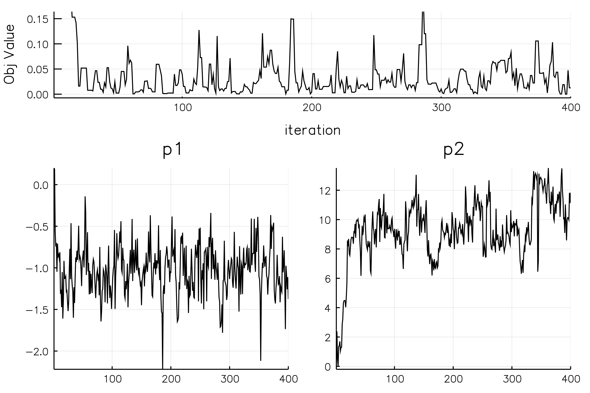
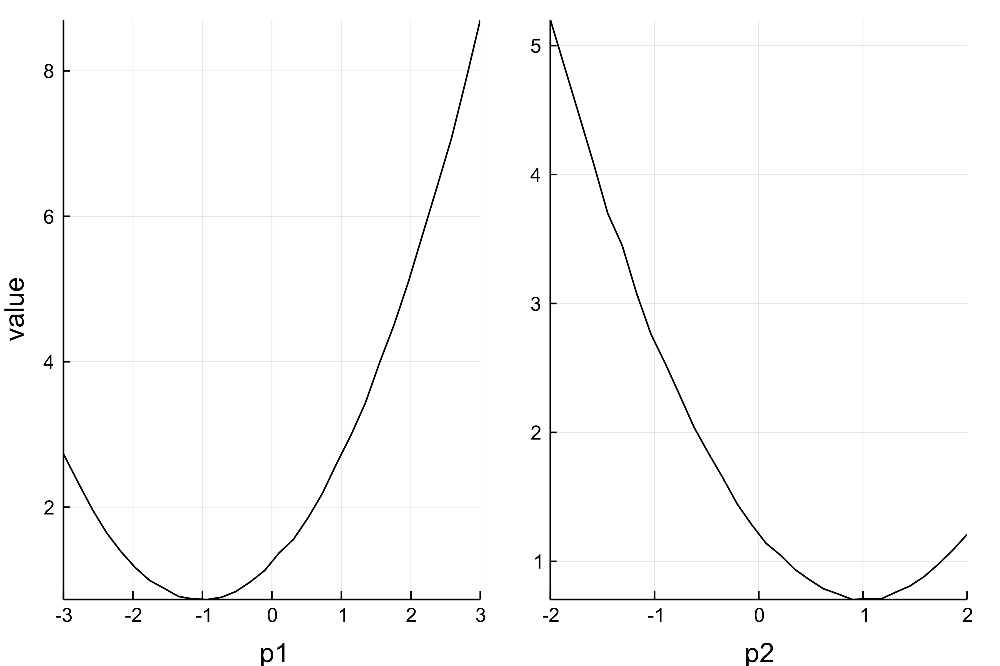
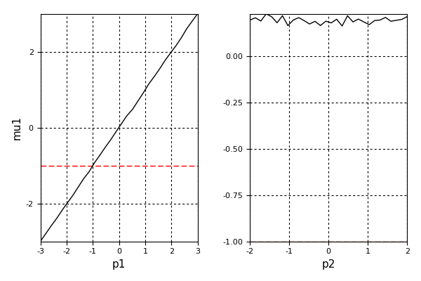
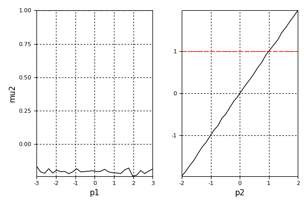
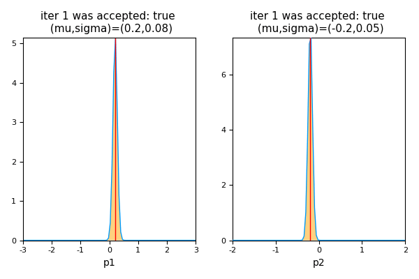

# MomentOpt.jl: Moment Optimization Library for Julia

Linux/MacOS: [](https://travis-ci.org/floswald/MomentOpt.jl)

Windows: [](https://ci.appveyor.com/project/floswald/MomentOpt.jl/branch/master)

This package provides a `Julia` infrastructure for *[Simulated Method of Moments](http://en.wikipedia.org/wiki/Method_of_simulated_moments)* estimation, or other problems where we want to optimize a non-differentiable objective function. The setup is suitable for all kinds of **likelihood-free estimators** - in general, those require evaluating the objective at many regions. The user can supply their own algorithms for generating successive new parameter guesses. We provide a set of MCMC template algorithms. The code can be run in serial or on a cluster.


## Installation

```julia
Pkg.clone("https://github.com/floswald/MomentOpt.jl")
```

## Documentation

Still work in progress, although most of the docstrings have been written - so checkout `?MomentOpt.BGPChain` for example in the REPL. I recommend to look at `src/mopt/Examples.jl` and the notebook `src/mopt/example.ipynb`:

## Example Usage of the BGP Algorithm

Baragatti, Grimaud and Pommeret (BGP) in ["Likelihood-free parallel tempring"](http://arxiv.org/abs/1108.3423) propose an approximate Bayesian Computation (ABC) algorithm that incorporates the parallel tempering idea of Geyer (1991). We provide the BGP algorithm as a template called `MAlgoBGP`. Here we use it to run a simple toy example where we want to estimate the means of a bivariate normal distribution by using MCMC. We use 3 parallel chains, each with different temperature. The chains can exchange locations along the process if this is suitable.


## Examples 


### Objective Function

The objective function used here for moment `k` is


 ```
 ( (simMoments[k] / dataMoment[k]) - 1.0 )^2
 ```


This was chosen so as to be able to accomodate moments at different scales. 

#### Chain Setup

All examples use three chains. They all vary the temperature of the hottest chain as well as the scale of moments to estimate. We will consider data with identical scale and data with widely disparate scales.

### Example with 2 Parameters on identical scale

Let's start slowly. Here we want to estimate the mean parameters of a bivariate normal distribution. The data are generated from mean vector `[-1,1]`, hence, the algorithm should find values `[-1,1]`.


```julia

julia> MomentOpt.snorm_standard()
INFO: These moments are our targets
INFO: Parameter p_i corresponds to moment m_i
2×3 DataFrames.DataFrame
│ Row │ name │ value │ weight │
├─────┼──────┼───────┼────────┤
│ 1   │ mu1  │ -1.0  │ -1.0   │
│ 2   │ mu2  │ 1.0   │ 1.0    │


summary(MA) = 3×5 DataFrames.DataFrame
│ Row │ id │ acc_rate │ perc_exchanged │ exchanged_most_with │ best_val   │
├─────┼────┼──────────┼────────────────┼─────────────────────┼────────────┤
│ 1   │ 1  │ 0.52907  │ 14.5           │ 2                   │ 7.99621e-5 │
│ 2   │ 2  │ 0.721805 │ 34.0           │ 3                   │ 0.00429487 │
│ 3   │ 3  │ 0.712418 │ 23.5           │ 2                   │ 0.0212968  │
```

#### Objective Function and Param History


#### Param Histogram


- [x] Works.

### Example with 2 Parameters on different scales

Now the two moments are an order of magnitude apart. 


```julia
julia> MomentOpt.serialNormal(2,400,save=true)
2×3 DataFrames.DataFrame
│ Row │ name │ value │ weight │
├─────┼──────┼───────┼────────┤
│ 1   │ mu1  │ -1.0  │ 1.0    │
│ 2   │ mu2  │ 10.0  │ 1.0    │

summary(MA) = 3×5 DataFrames.DataFrame
│ Row │ id │ acc_rate │ perc_exchanged │ exchanged_most_with │ best_val    │
├─────┼────┼──────────┼────────────────┼─────────────────────┼─────────────┤
│ 1   │ 1  │ 0.644258 │ 10.75          │ 2                   │ 0.000112698 │
│ 2   │ 2  │ 0.75     │ 29.0           │ 3                   │ 0.00648252  │
│ 3   │ 3  │ 0.832808 │ 20.75          │ 2                   │ 0.0240667   │

```

#### Objective Function and Param History



#### Param Histogram


- [x] Still Works.
- [x] 2 moments one order of magnitude apart.


## Example with 6 parameters on identical scales


```julia
julia> MomentOpt.snorm_standard6()
INFO: These moments are our targets
INFO: Parameter p_i corresponds to moment m_i
6×3 DataFrames.DataFrame
│ Row │ name │ value │ weight │
├─────┼──────┼───────┼────────┤
│ 1   │ mu1  │ -1.0  │ -1.0   │
│ 2   │ mu2  │ 1.0   │ 1.0    │
│ 3   │ mu3  │ 0.5   │ 0.5    │
│ 4   │ mu4  │ -0.5  │ -0.5   │
│ 5   │ mu5  │ 0.7   │ 0.7    │
│ 6   │ mu6  │ -0.7  │ -0.7   │

summary(MA) = 3×5 DataFrames.DataFrame
│ Row │ id │ acc_rate │ perc_exchanged │ exchanged_most_with │ best_val  │
├─────┼────┼──────────┼────────────────┼─────────────────────┼───────────┤
│ 1   │ 1  │ 0.326531 │ 2.0            │ 2                   │ 0.0268808 │
│ 2   │ 2  │ 0.642857 │ 9.0            │ 3                   │ 0.157052  │
│ 3   │ 3  │ 0.702703 │ 7.5            │ 2                   │ 0.834925  │
(


```

#### Objective Function and Param History


#### Param Histogram


- [x] Works with more than 2 moments!

## Example with 6 parameters on different scales

This example is to illustrate that the tuning parameters `acc_tuner`, `maxtemp` and `coverage` are all important. There is no one set of those that will yield a successful estimation: all depends on the location of the moments, the corresponding starting value of each parameter guess and the total number of moments. In those examples, these are randomly generated and often lie very far apart, which creates a particularly challenging setting for a SMM objective function. 


```julia
julia> MomentOpt.serialNormal(6,1000,save=true)
INFO: These moments are our targets
INFO: Parameter p_i corresponds to moment m_i
6×3 DataFrames.DataFrame
│ Row │ name │ value        │ weight       │
├─────┼──────┼──────────────┼──────────────┤
│ 1   │ mu1  │ -1.0         │ 1.0          │
│ 2   │ mu2  │ 10.0         │ 1.0          │
│ 3   │ mu3  │ -0.000511669 │ -0.000511669 │
│ 4   │ mu4  │ 16.8189      │ 16.8189      │
│ 5   │ mu5  │ 2.91133      │ 2.91133      │
│ 6   │ mu6  │ -43.02       │ -43.02       │


summary(MA) = 3×5 DataFrames.DataFrame
│ Row │ id │ acc_rate  │ perc_exchanged │ exchanged_most_with │ best_val  │
├─────┼────┼───────────┼────────────────┼─────────────────────┼───────────┤
│ 1   │ 1  │ 0.0151976 │ 1.3            │ 2                   │ 0.0363635 │
│ 2   │ 2  │ 0.0243902 │ 1.6            │ 1                   │ 0.0982443 │
│ 3   │ 3  │ 0.0242424 │ 1.0            │ 2                   │ 0.237178  │


```

#### Objective Function and Param History


You can see that it takes a while for the algorithm to find the right area. 

- [x] Still works.
- [x] need to run long enough
- [ ] heuristic to choose tuning parameters? NA.


### More Examples

are in `src/Examples.jl`

## Other Features

One produce slices of ones objective function:

**Slices of objective function wrt parameters**  

  

**Slices of moments wrt parameters**  

  
  

**Track BGP proposals by iteration**  

One can allow for the variance of the shock to be changed adaptively. Here this is fixed to obtain a certain acceptance probability. Showing chain number 1, here with fixed variance.



### Example Notebook

Please check out a fully worked example in [`src/example.ipynb`](src/example.ipynb).

## Contributing

We encourage user contributions. Please submit a pull request for any improvements you would like to suggest, or a new algorithm you implemented.

New algorithms:
* You can model your algo on the basis of `src/AlgoBGP.jl` -
* you need to implement the function `computeNextIteration!( algo )` for your `algo`

## Thanks to all Contributors!

* [Julien Pascal](https://github.com/JulienPascal)
* [Edoardo Ciscato](https://github.com/edoardociscato)
