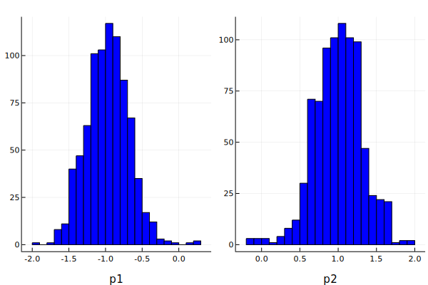
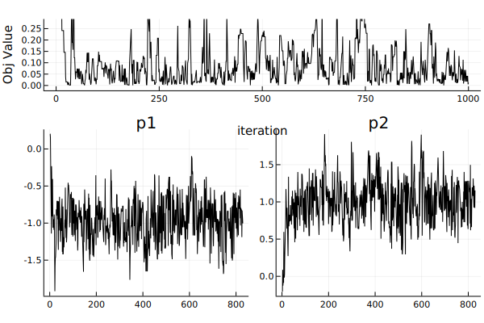
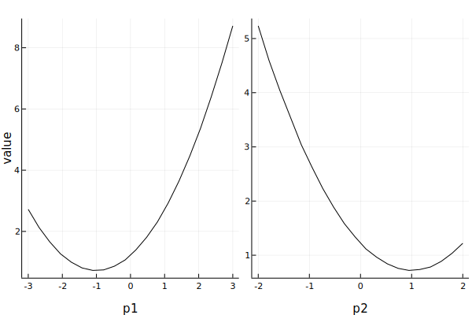
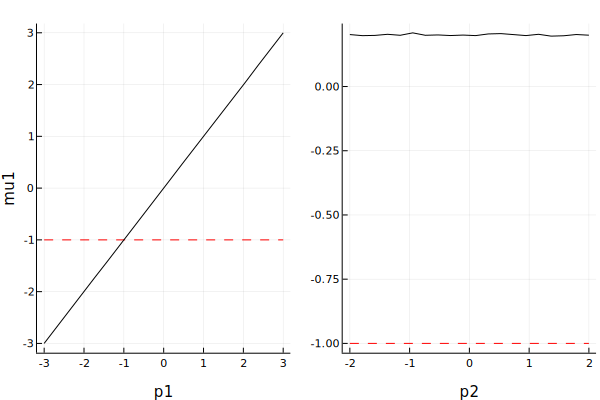
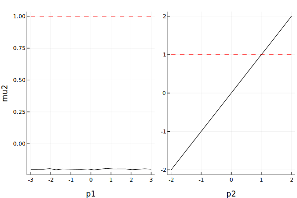

# MomentOpt.jl: Moment Optimization Library for Julia

Linux/MacOS: [](https://travis-ci.com/floswald/MomentOpt.jl)

Windows: [](https://ci.appveyor.com/project/floswald/MomentOpt.jl/branch/master)

[](https://coveralls.io/github/floswald/MomentOpt.jl?branch=master)

[](http://codecov.io/github/floswald/MomentOpt.jl?branch=master)

This package provides a `Julia` infrastructure for *[Simulated Method of Moments](http://en.wikipedia.org/wiki/Method_of_simulated_moments)* estimation, or other problems where we want to optimize a non-differentiable objective function. The setup is suitable for all kinds of **likelihood-free estimators** - in general, those require evaluating the objective at many regions. The user can supply their own algorithms for generating successive new parameter guesses. We provide a set of MCMC template algorithms. The code can be run in serial or on a cluster.


## Installation

```julia
Pkg.clone("https://github.com/floswald/MomentOpt.jl")
```

## Documentation

Still work in progress, although most of the docstrings have been written - so checkout `?MOpt.BGPChain` for example in the REPL. I recommend to look at `src/motp/Examples.jl` and the notebook `src/motp/Example_Parallel.ipynb`:

### Example Usage of the BGP Algorithm

Baragatti, Grimaud and Pommeret (BGP) in ["Likelihood-free parallel tempring"](http://arxiv.org/abs/1108.3423) propose an approximate Bayesian Computation (ABC) algorithm that incorporates the parallel tempering idea of Geyer (1991). We provide the BGP algorithm as a template called `MAlgoBGP`. Here we use it to run a simple toy example where we want to estimate the means of a bivariate normal distribution by using MCMC. We use 3 parallel chains, each with different temperature. The chains can exchange locations along the process if this is suitable.

#### Preliminaries

The first step is to set up the environment. MomentOpt will run chains in parallel
if several workers are available. If you want to use MomentOpt in serial, you may
skip the following step, and get rid of the macro ``@everywhere`.
In what follows, we increase the number of workers to 4 and we load the packages we are going to use.
```julia
# Current number of workers
#--------------------------
currentWorkers = nprocs()
println("Initial number of workers = $(currentWorkers)")

# I want to have 4 workers running
#--------------------------------
maxNumberWorkers = 4

while nprocs() < maxNumberWorkers
    addprocs(1)
end

# check the number of workers:
#----------------------------
currentWorkers = nprocs()
println("Number of workers = $(currentWorkers)")

@everywhere using MomentOpt
@everywhere using GLM
@everywhere using DataStructures
@everywhere using DataFrames
@everywhere using Plots; plotlyjs()

# Whether or not we want to save plots to disk
savePlots = true
```
#### Primitives of the problem

We then define primitives of the problem, by specifying the moments to be matched,
priors values, and the supports.
```julia
#------------------------
# initialize the problem:
#------------------------
# true Values of the parameters:
#-------------------------------
trueValues = OrderedDict("mu1" => [-1.0] , "mu2" => [1.0])

# Specify the initial values for the parameters, and their support:
#------------------------------------------------------------------
pb = OrderedDict("p1" => [0.2,-3,3] , "p2" => [-0.2,-2,2])

# Specify moments to be matched + subjective weights:
#----------------------------------------------------
moms = DataFrame(name=["mu1","mu2"],value=[-1.0,1.0], weight=ones(4))
```
#### Objective function

We then define the objective function to be minimized. It has to take an `Eval`
object as a first argument. Here `verbose` is an optional argument, used to
display additional information when needed. The objective function has
to set its value (`setValue()`) and the associated moments (`setMoment()`):
```julia
# GMM objective function to be minimized.
# It returns a weighted distance between empirical and simulated moments
@everywhere function objfunc_normal(ev::Eval; verbose = false)

    start(ev)


    # when running in parallel, display worker's id:
    #-----------------------------------------------
    if verbose == true
        if nprocs() > 1
          println(myid())
        end
    end

    # extract parameters from ev:
    #----------------------------
    mu  = collect(values(ev.params))

    # compute simulated moments
    #--------------------------
    # Monte-Carlo:
    #-------------
    ns = 10000 #number of i.i.d draws from N([mu], sigma)
    #initialize a multivariate normal N([mu], sigma)
    #mu is a four dimensional object
    #sigma is set to be the identity matrix
    sigma = [1.0 ;1.0]
    # draw ns observations from N([mu], sigma):
    randMultiNormal = MomentOpt.MvNormal(mu,MomentOpt.PDiagMat(sigma))
    # calculate the mean of the simulated data
    simM            = mean(rand(randMultiNormal,ns),2)
    # store simulated moments in a dictionary
    simMoments = Dict(:mu1 => simM[1], :mu2 => simM[2])

    # Calculate the weighted distance between empirical moments
    # and simulated ones:
    #-----------------------------------------------------------
    v = Dict{Symbol,Float64}()
    for (k, mom) in dataMomentd(ev)
        # If weight for moment k exists:
        #-------------------------------
        if haskey(MomentOpt.dataMomentWd(ev), k)
            # divide by weight associated to moment k:
            #----------------------------------------
            v[k] = ((simMoments[k] .- mom) ./ MomentOpt.dataMomentW(ev,k)) .^2
        else
            v[k] = ((simMoments[k] .- mom) ) .^2
        end
    end

    # Set value of the objective function:
    #------------------------------------
    setValue(ev, mean(collect(values(v))))

    # also return the moments
    #-----------------------
    setMoment(ev, simMoments)

    # flag for success:
    #-------------------
    ev.status = 1

    # finish and return
    finish(ev)

    return ev
end
```

We then create an ̀`MProb` object, to which we add priors and supports, the moments
to be matched, and the objective function.

```julia
# Initialize an empty MProb() object:
#------------------------------------
mprob = MProb()

# Add structural parameters to MProb():
# specify starting values and support
#--------------------------------------
addSampledParam!(mprob,pb)

# Add moments to be matched to MProb():
#--------------------------------------
addMoment!(mprob,moms)

# Attach an objective function to MProb():
#----------------------------------------
addEvalFunc!(mprob, objfunc_normal)

```
The last step before launching the estimation is to specify options in a dictionary.
The ̀`MProb()` object and the dictionary containing options are then tied together
by defining and MAlgoBGP type.

```julia
# estimation options:
#--------------------
# number of iterations for each chain
niter = 1000
# number of chains
nchains = 3

opts = Dict("N"=>nchains,
        "maxiter"=>niter,
        "maxtemp"=> 5,
        "coverage"=>0.025,
        "sigma_update_steps"=>10,
        "sigma_adjust_by"=>0.01,
        "smpl_iters"=>1000,
        "parallel"=>true,
        "maxdists"=>[0.05 for i in 1:nchains],
        "mixprob"=>0.3,
        "acc_tuner"=>12.0,
        "animate"=>false)

# set-up BGP algorithm:
MA = MAlgoBGP(mprob,opts)
```

We then run the estimation and display the results
```julia
# run the estimation:
@time MomentOpt.runMOpt!(MA)

# show a summary of the optimization:
@show MomentOpt.summary(MA)
```

The series of draws and the corresponding histogram can be displayed
```julia
# Plot histograms for the first chain, the one with which inference should be done.
# Other chains are used to explore the space and avoid local minima
#-------------------------------------------------------------------------------
p1 = histogram(MA.chains[1])
display(p1)

if savePlots == true
    savefig(p1, joinpath(pwd(),"histogram_chain_1.svg"))
end

# Plot the realization of the first chain
#----------------------------------------
p2 = plot(MA.chains[1])
if savePlots == true
    savefig(p2, joinpath(pwd(),"history_chain_1.svg"))
end
display(p2)
```

#### inference

With the BGP algorithm, inference can be done with the first chain. Other
chains are only used to explore the space to avoid local minima.
Below we report the mean and the median of accepted draws, discarding the first
10th observations ("burn-in"):
```julia
# Realization of the first chain:
#-------------------------------
dat_chain1 = MomentOpt.history(MA.chains[1])

# discard the first 10th of the observations ("burn-in" phase):
#--------------------------------------------------------------
dat_chain1[round(Int, niter/10):niter, :]

# keep only accepted draws:
#--------------------------
dat_chain1 = dat_chain1[dat_chain1[:accepted ].== true, : ]

# create a list with the parameters to be estimated
#--------------------------------------------------
parameters = [Symbol(String("mu$(i)")) for i=1:2]

# list with the corresponding priors:
#------------------------------------
estimatedParameters = [Symbol(String("p$(i)")) for i=1:2]

# Quasi Posterior mean and quasi posterior median for each parameter:
#-------------------------------------------------------------------
for (estimatedParameter, param) in zip(estimatedParameters, parameters)

  println("Quasi posterior mean for $(String(estimatedParameter)) = $(mean(dat_chain1[estimatedParameter]))")
  println("Quasi posterior median for $(String(estimatedParameter)) = $(median(dat_chain1[estimatedParameter]))")
  println("True value = $(trueValues[String(param)][])")

end
```

#### Slices

Slices of the objective function can be obtained using the function `doSlices`

```julia
# plot slices of objective function
# grid with 20 points
#-----------------------------------
s = doSlices(mprob,20)

# plot slices of the objective function:
#---------------------------------------
p = MomentOpt.plot(s,:value)
display(p)

if savePlots == true
    Plots.savefig(p, joinpath(pwd(),"slices_Normal.svg"))
end

# Produce more precise plots with respect to each parameter:
#-----------------------------------------------------------
for symbol in parameters

  p = MomentOpt.plot(s,symbol)
  display(p)

  if savePlots == true
      Plots.savefig(p, joinpath(pwd(),"slices_Normal_$(String(symbol)).svg"))
  end


end

```

**histogram**  

  


**history**  

  

**Slices of objective function wrt parameters**  

  

**Slices of moments wrt parameters**  

  
  

## Contributing

We encourage user contributions. Please submit a pull request for any improvements you would like to suggest, or a new algorithm you implemented.

New algorithms:
* You can model your algo on the basis of `src/AlgoBGP.jl` -
* you need to implement the function `computeNextIteration!( algo )` for your `algo`
